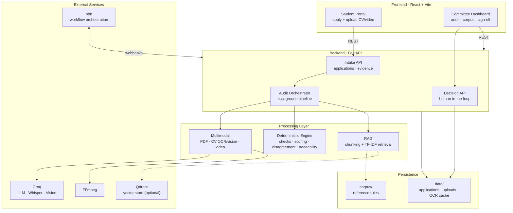

# Global Architecture Overview

Grant Panel Simulator — high-level component view.

```mermaid
flowchart TB
    subgraph Client["Frontend · React + Vite"]
        SP["Student Portal<br/>apply + upload CV/video"]
        CP["Committee Dashboard<br/>audit · corpus · sign-off"]
    end

    subgraph API["Backend · FastAPI"]
        IN["Intake API<br/>applications · evidence"]
        ORC["Audit Orchestrator<br/>background pipeline"]
        DEC["Decision API<br/>human-in-the-loop"]
    end

    subgraph Processing["Processing Layer"]
        MM["Multimodal<br/>PDF · CV OCR/vision · video"]
        EN["Deterministic Engine<br/>checks · scoring · disagreement · traceability"]
        RAG["RAG<br/>chunking + TF-IDF retrieval"]
    end

    subgraph External["External Services"]
        GROQ["Groq<br/>LLM · Whisper · Vision"]
        N8N["n8n<br/>workflow orchestration"]
        QDR["Qdrant<br/>vector store (optional)"]
        FF["FFmpeg"]
    end

    subgraph Storage["Persistence"]
        DATA["data/<br/>applications · uploads · OCR cache"]
        CORP["corpus/<br/>reference rules"]
    end

    SP -->|REST| IN
    CP -->|REST| API
    IN --> ORC
    ORC --> MM
    ORC --> EN
    ORC --> RAG
    MM --> GROQ
    MM --> FF
    RAG --> CORP
    RAG -.-> QDR
    CP --> DEC
    DEC --> DATA
    API --> DATA
    N8N <-->|webhooks| API
```
